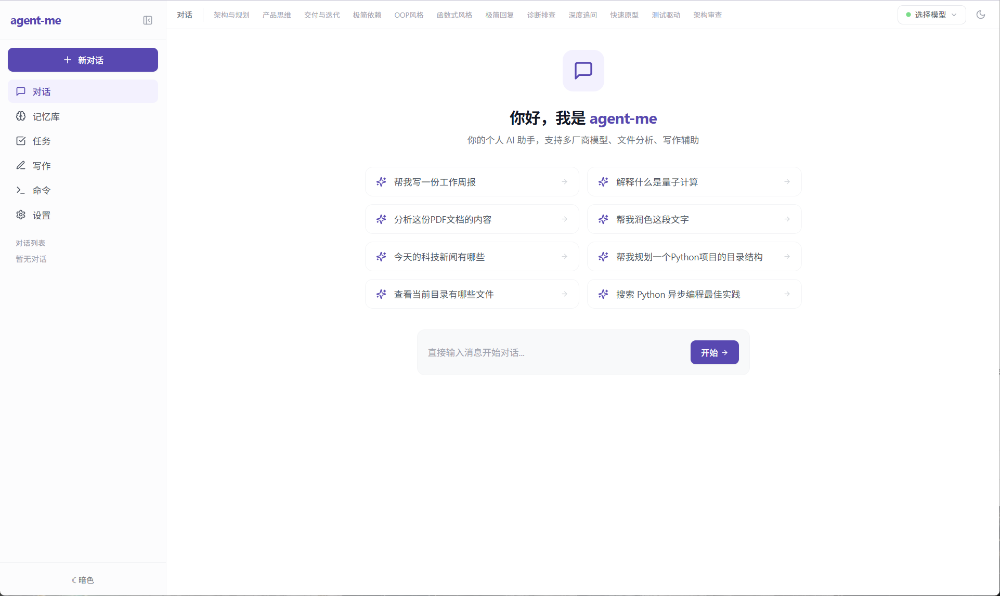
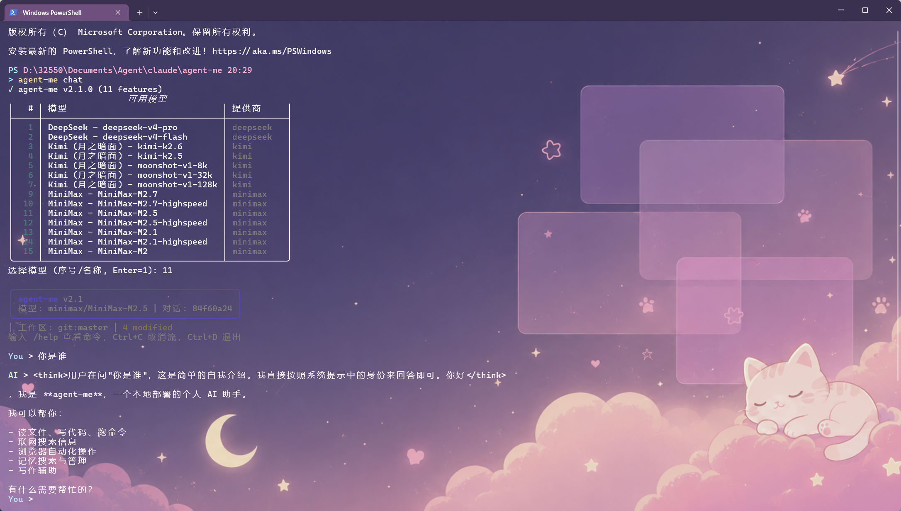
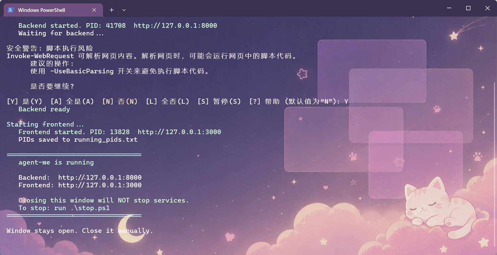
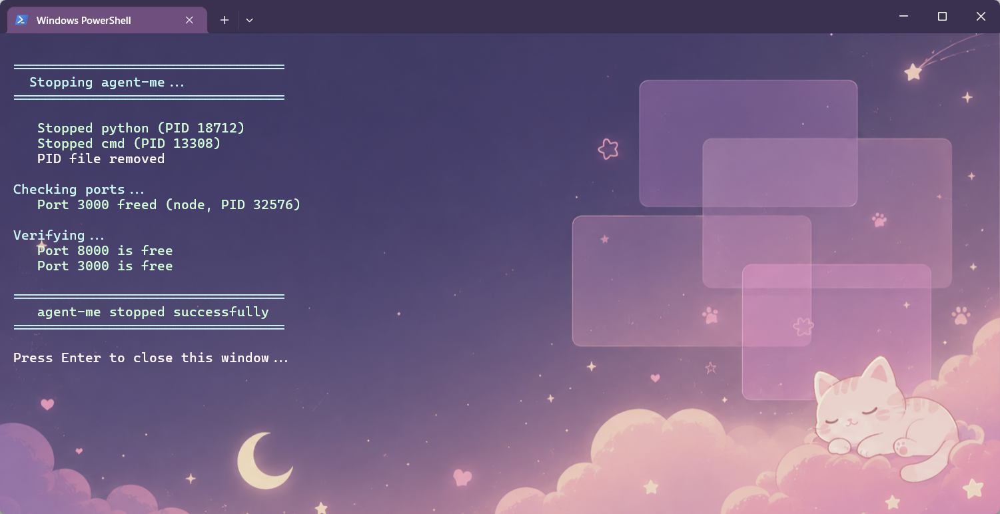

# agent-me v2.2 — Universal Personal AI Agent

A fully local-deployed personal AI agent. Multi-LLM support, smart memory, file analysis, automated tool calling, Web/CLI dual interface. All conversation data stays on your machine — privacy you can control.

## Quick Start

### Prerequisites

- Python ≥ 3.10
- Node.js ≥ 18

### 1. Clone

```bash
git clone https://github.com/swfk2154/agent-me.git
cd agent-me
```

### 2. Install & Start (Windows)

All scripts live in `script/`:

| Step | Script | When to use |
|------|--------|-------------|
| **Install** | `script\install.bat` | First time — installs all Python + Node.js deps |
| **Start** | `script\start.ps1` | Every session — launches backend (port 8000) + frontend (port 3000) |
| **Stop** | `script\stop.ps1` | When done — stops all services |

**Step-by-step:**

```powershell
:: 1. Install (one time only)
script\install.bat                    → Light version (~50MB)
script\install.bat --full             → Full version (+file analysis, ~400MB)
script\install.bat --mirror           → China mirrors for slow downloads

:: 2. Start (in PowerShell)
powershell -ExecutionPolicy Bypass -File script\start.ps1

:: 3. Open browser
http://localhost:3000

:: 4. Configure
Settings → LLM Config → pick provider → enter API Key → save → enable

:: 5. Stop (in PowerShell)
powershell -ExecutionPolicy Bypass -File script\stop.ps1
```

> PowerShell alternative (if `.bat` fails):
> ```powershell
> Set-ExecutionPolicy -ExecutionPolicy RemoteSigned -Scope Process
> .\script\install.ps1
> .\script\start.ps1
> .\script\stop.ps1
> ```

### macOS / Linux

```bash
chmod +x script/install.sh script/start.sh script/stop.sh
script/install.sh
script/start.sh
script/stop.sh
```

### Manual Setup

```bash
# Backend
cd backend
pip install -r requirements.txt
python3 -m uvicorn main:app --port 8000

# Frontend (separate terminal)
cd frontend
npm install
npm run dev

# CLI (optional)
cd cli
pip install -e .
```

### Configure & Use

1. Open `http://localhost:3000`
2. **Settings** → **LLM Config** → pick provider → enter API Key → save
3. Click **Test** to verify connection
4. Toggle the provider **enabled**
5. Go to **Chat** tab, select your model
6. Start typing

## Features

| Feature | Description |
|---------|-------------|
| **Multi-turn Chat** | SSE streaming + Markdown + code highlighting, Ctrl+C to cancel |
| **Auto Agent Mode** | Automatically decides whether to call tools |
| **10 Built-in Tools** | Web search, weather, news, file read, directory list, command execution, memory search, file search, browser control, current time |
| **18 Skill Modes** | Architecture planning, product mindset, ship-first, minimal deps, OOP, functional, Claude Code, Cursor, pair programming, caveman, diagnose, grill, prototype, TDD, review, triage, zoom-out, security |
| **9 LLM Providers** | OpenAI / Anthropic / Google / DeepSeek / Kimi / MiniMax / GLM / Doubao / Custom |
| **Smart Memory v2.0** | Short-term (50 rounds) + long-term (vector/SQLite) + user profile (auto fact extraction) |
| **Session Summaries** | Auto-generated every 20 rounds, replaces per-message storage |
| **File Analysis** | PDF/DOCX/TXT → chunking → RAG (Full edition) |
| **Writing Assistant** | 10 templates: polish, expand, condense, translate, formal, casual, outline, email, weekly report |
| **Task Management** | Kanban with due dates |
| **Web Search** | DuckDuckGo (free) / Tavily / Brave / SerpAPI / Serper / SearXNG / Custom |
| **Command Execution** | 3-tier security (allow/confirm/deny) + risk pattern detection |
| **Browser Control** | Kimi WebBridge: navigate, click, screenshot |
| **Conversation Export** | Markdown / JSON |
| **Dark Mode** | Auto-follow system / manual toggle |
| **Token Savings** | History truncation + Anthropic prompt caching (90% cost reduction) |

## Screenshots

**Web UI**                                             **CLI**

                  

**Windows start**                                    **Windows stop**

                 

## Auto Agent Mode

No manual switching needed:

- **"Write a Python script"** → Normal chat
- **"Search async Python best practices"** → Calls `web_search`
- **"List files in current directory"** → Calls `list_directory`
- **"Read backend/main.py"** → Calls `read_file`
- **"Open github.com"** → Calls `browser_navigate`

### 10 Built-in Tools

| Tool | Function | Restrictions |
|------|----------|-------------|
| `get_current_time` | Current date/time | None |
| `web_search` | Web search | None |
| `get_weather` | Weather by city (free, wttr.in) | None |
| `get_news` | News by keyword | NewsAPI key or fallback to search |
| `read_file` | Read local files | 100KB limit, path whitelist |
| `list_directory` | List directory contents | Max depth 3 |
| `run_command` | Execute shell commands | Allowlist only |
| `search_memory` | Retrieve long-term memory | None |
| `search_files` | Search uploaded files | None |
| `browser_navigate` | Browser automation | 15s timeout |

## Tech Stack

| Layer | Technology |
|-------|-----------|
| Backend | Python 3.10+ · FastAPI · ChromaDB · SQLite |
| Frontend | React 18 · Zustand · TailwindCSS · Vite |
| CLI | Click · Rich · HTTPX |
| Encryption | Fernet, key separate from data |
| Embeddings | sentence-transformers (all-MiniLM-L6-v2) |

## Project Structure

```
agent-me/
├── script/                    # Install/start/stop scripts
├── SYSTEM_PROMPT.md           # Runtime system prompt
├── backend/                   # FastAPI backend
│   ├── main.py                # Entry point
│   ├── app_config/            # Providers, settings, encryption, logging
│   ├── routes/                # 12 route modules
│   ├── services/              # Service layer
│   ├── models/                # Pydantic models
│   └── storage/               # SQLite, ChromaDB, config, uploads, logs
├── frontend/                  # React SPA
└── docs/                       # Screenshots (Web UI / CLI / start / stop)
```

## CLI Reference

```bash
# === Core ===
agent-me chat              # Interactive chat (model selection on start, slash commands)
agent-me ask "question"    # One-shot question, -m model -f file -s skill --search

# === Model & Config ===
agent-me models            # List available models
agent-me config list       # List provider configs
agent-me config set <id>   # Interactive API Key setup (hidden input)
agent-me config test <id>  # Test connection

# === Conversation ===
agent-me conversations     # List all conversations
agent-me export [id]       # Export conversation (Markdown)

# === Search & Memory ===
agent-me search "query"    # Web search
agent-me memory "keyword"  # Search long-term memory

# === Other ===
agent-me tasks             # View task list
agent-me status            # Check backend status
agent-me logs -n 50        # View backend logs
```

### CLI Slash Commands

Inside `agent-me chat`:

| Command | Function |
|---------|----------|
| `/new [title]` | New conversation |
| `/list` | List all conversations |
| `/switch <ID>` | Switch to conversation |
| `/model [name]` | View or switch model |
| `/skill [name]` | View or switch skill mode |
| `/search [query]` | Temporary web search |
| `/file <path>` | Upload file |
| `/clear` | Clear current conversation |
| `/history` | Show conversation history |
| `/info` | Show current session info |
| `/export [ID]` | Export as Markdown |
| `/help` | Show help |
| `/quit` | Exit |

## Privacy

- API Keys encrypted with Fernet at `backend/storage/config.enc`
- Conversations stored only in local SQLite + ChromaDB
- No data uploaded to third-party servers

## Changelog

### v2.1 (2025-06-13)

- **Auto Agent**: automatic tool determination from message content
- **Tool expansion**: 3 → 10 tools (weather, news, file ops, command execution, browser control, time)
- **Tool system refactor**: BaseTool + ToolRegistry pattern
- **Safety fuse**: auto-stop after 3 consecutive tool failures
- **Static frontend hosting**: single-process deployment with `npm run build`
- **Smart Memory v2.0**: fact extraction, summaries, scoring, time decay
- **Structured profile**: name + preferences + skills + habits + facts
- **Security**: CORS, error sanitization, command evaluation, magic number validation
