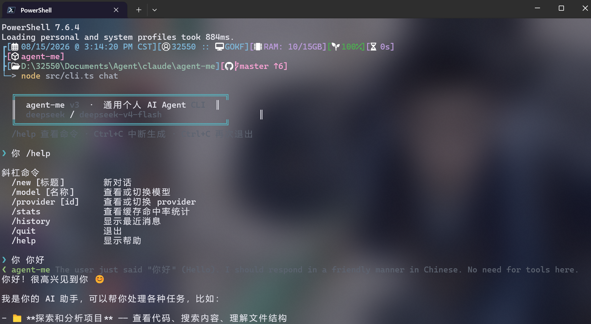
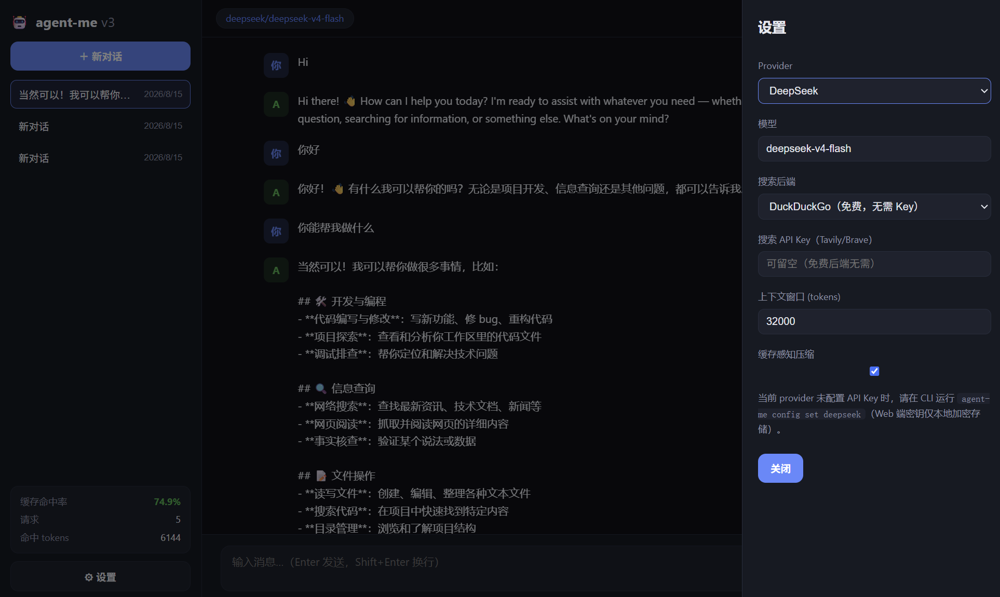

# agent-me v3 — Universal Personal AI Agent

A high-performance personal AI agent rewritten in TypeScript: **Web + CLI dual mode**, **cache-aware context management** (prompt-cache hit-rate optimization), multi-LLM providers, tool calling, long-term memory, and sandboxed command execution. Single-process deployment with a zero-runtime-dependency core (Node ≥ 24 native TypeScript + built-in `node:sqlite`).

> 🌐 中文版: [README_CN.md](README_CN.md)

---

## Screenshots

| CLI mode | Web mode |
|:---:|:---:|
|  |  |

---

## Features

| Feature | Description |
|---------|-------------|
| **Dual mode** | CLI (colorful interactive UI) + Web (browser UI with SSE streaming) sharing one core |
| **Cache hit-rate optimization** | Stable prefix / append-only log / summary compaction / explicit breakpoints (details below) |
| **Multi-LLM providers** | OpenAI / Anthropic / DeepSeek / Kimi / GLM / Doubao / MiniMax / Google / Ollama / Custom |
| **Env-var auto-discovery** | Reuses conventional variables like `DEEPSEEK_API_KEY`, with Windows registry fallback — zero config |
| **Tool calling** | Web search (free backends + auto fallback), page fetching, file read/write, code grep, command execution, long-term memory, ask-user |
| **Reasoning display** | Real-time thinking streams from DeepSeek / OpenAI / Anthropic (gray text in CLI, collapsible block in Web) |
| **Two-layer security** | Sandbox tiers (`read-only` / `workspace-write` / `danger-full-access`) × approval policies (`untrusted` / `on-request` / `never`) |
| **Long-term memory** | Keyword retrieval with time decay; `AGENTS.md` project instructions injected |
| **Headless mode** | `ask --output-format json\|stream-json` — script & CI friendly |
| **Encrypted keys** | API keys stored with AES-256-GCM; key file separated from ciphertext |

---

## Installation (from clone to run)

### 1. Requirements

| Dependency | Version | Notes |
|------------|---------|-------|
| [Node.js](https://nodejs.org) | ≥ 24 | Runs TypeScript natively (no build step), built-in SQLite, fetch/SSE |
| git | any | To clone the repository |

> Verify: `node --version` should print v24 or higher.

### 2. Clone the repository

```bash
git clone https://github.com/swfk2154/agent-me.git
cd agent-me
```

### 3. Install dependencies

```bash
npm install
```

> In China: npm usually already uses a mirror (registry.npmmirror.com); if not,
> run `npm config set registry https://registry.npmmirror.com`.

### 4. Configure an API key (pick one)

**Option A — Environment variable (recommended)**:

```powershell
# Windows (current session)
$env:DEEPSEEK_API_KEY = "sk-your-key"
# Permanent
setx DEEPSEEK_API_KEY "sk-your-key"
```

```bash
# macOS / Linux
export DEEPSEEK_API_KEY="sk-your-key"   # add to ~/.bashrc or ~/.zshrc
```

**Option B — Encrypted store**: run `node src/cli.ts config set deepseek` and type the key (hidden input).

**Option C — Windows registry fallback**: user-level environment variables are auto-detected from any environment.

Verify:

```bash
node src/cli.ts providers              # key status per provider (env / store / missing)
node src/cli.ts config test deepseek   # real connectivity test
```

### 5. Start the CLI mode

```bash
node src/cli.ts chat
```

Or double-click `script\start-cli.bat` (Windows).

### 6. Start the Web mode

```bash
npm run build:web          # build the frontend once (not needed afterwards)
node src/cli.ts serve      # open http://127.0.0.1:8080 in your browser
```

Or double-click `script\start-web.bat` (Windows; auto-builds the frontend).

### 7. Common startup issues

| Issue | Fix |
|-------|-----|
| `EADDRINUSE: port 8080 in use` | An agent-me instance may already be running — just open http://127.0.0.1:8080; or use another port: `node src/cli.ts serve --port 8081` |
| `API key not configured` | Set the environment variable or run `node src/cli.ts config set <provider>` |

### 8. Updating

```bash
git pull
npm install
npm run build:web    # only when the frontend changed
```

---

## CLI usage

```bash
node src/cli.ts chat        # interactive chat (slash commands below)
node src/cli.ts ask "question" [--output-format text|json|stream-json] [-f file] [--conversation-id ID]
node src/cli.ts serve [--port 8080]
node src/cli.ts models      # all providers & models
node src/cli.ts providers   # key status
node src/cli.ts config list|set|test|provider|model
node src/cli.ts stats       # cache hit-rate stats
node src/cli.ts memory search|add|list
node src/cli.ts --help
```

**Slash commands**: `/new` new conversation · `/model` switch model · `/provider` switch provider · `/stats` cache stats · `/history` recent messages · `/help` · `/quit`

**UI elements**: gray text = thinking/reasoning; `⚙️` = tool call; `[in N tok · cache 命中 X%]` = per-request cache hit rate (≥70% green / ≥30% yellow / otherwise red).

**Security flags**:

```bash
node src/cli.ts chat --sandbox read-only              # read-only
node src/cli.ts chat --sandbox workspace-write        # default
node src/cli.ts chat --approval never                 # never ask (dangerous commands still refused)
```

---

## Web usage

After starting, open http://127.0.0.1:8080:

- **Left sidebar**: new conversation, history list, **cache hit-rate panel** (rate / requests / hit tokens; ≥70% highlighted green)
- **Center chat**: streaming replies (`▊` cursor), collapsible thinking blocks (yellow border), tool-call cards (⚙ args/result, red on failure), ■ stop button
- **Settings drawer** (⚙): provider / model / search backend (DuckDuckGo·Bing free, Tavily·Brave need a key) / context window / cache-compaction toggle

**REST API**: `GET /api/health` · `POST /api/chat` (SSE stream: delta/thinking/tool_call/tool_result/usage/done/ask) · `GET/PUT /api/config` · `GET /api/stats` · `GET/DELETE /api/conversations[/:id]` · `POST /api/answer`

---

## Cache hit-rate optimization (core feature)

Prompt caching is the key to LLM cost and latency. agent-me builds cache-friendliness into the context manager (`src/core/context/manager.ts`):

1. **Stable prefix** — the system prompt and tool schema are byte-identical (tools sorted by name); dynamic data (time, etc.) never enters the system prompt;
2. **Append-only log** — history is only ever appended, never rewritten or reordered, so automatic prefix caching (DeepSeek/OpenAI) keeps hitting;
3. **Cache-aware compaction** — when the window overflows, the oldest messages are replaced by **one frozen summary**; everything after the trim point stays untouched. Every request starts with a constant prefix: `[system] [tools] [summary] [recent…]`;
4. **Explicit breakpoints** (Anthropic) — `cache_control: ephemeral` at token intervals for incremental hits on long conversations;
5. **Observable hit rate** — CLI `/stats`, Web panel, and headless JSON all report it.

---

## Environment variables

| Provider | API key variable | Base-URL override |
|----------|------------------|-------------------|
| OpenAI | `OPENAI_API_KEY` | `OPENAI_BASE_URL` |
| Anthropic | `ANTHROPIC_API_KEY` | `ANTHROPIC_BASE_URL` |
| DeepSeek | `DEEPSEEK_API_KEY` | `DEEPSEEK_BASE_URL` |
| Kimi | `MOONSHOT_API_KEY` / `KIMI_API_KEY` | `MOONSHOT_BASE_URL` |
| Google | `GEMINI_API_KEY` / `GOOGLE_API_KEY` | `GEMINI_BASE_URL` |
| GLM | `GLM_API_KEY` / `ZHIPU_API_KEY` | `GLM_BASE_URL` |
| Doubao | `DOUBAO_API_KEY` / `ARK_API_KEY` | `DOUBAO_BASE_URL` |
| MiniMax | `MINIMAX_API_KEY` | `MINIMAX_BASE_URL` |
| Custom | `AGENT_ME_API_KEY` | `AGENT_ME_BASE_URL` |

---

## Security model

| Flag | Values | Meaning |
|------|--------|---------|
| `--sandbox` | `read-only` / `workspace-write` / `danger-full-access` | Where the agent may touch |
| `--approval` | `untrusted` / `on-request` / `never` | When it asks the user |

Default: `workspace-write` + `on-request`. Destructive commands (recursive delete, format, system modification, …) are always refused at every tier. File tools are confined to the workspace root (symlink-escape protection).

---

## Project structure

```
src/
├── cli.ts                 # CLI entry (chat / ask / serve / config / stats / memory)
├── server.ts              # Web entry (hono + SSE + static frontend hosting)
├── runtime.ts             # shared wiring for CLI & Web
└── core/
    ├── config.ts          # config + key encryption + env-var discovery
    ├── llm/               # OpenAI-compatible + Anthropic (cache headers/thinking)
    ├── context/           # ★ cache-aware context management
    ├── agent/             # agent loop (tool calls, fuse, abort)
    ├── tools/             # tool registry + implementations (security model)
    ├── store/             # SQLite (node:sqlite, zero deps)
    ├── memory/            # long-term memory
    └── prompts/           # system prompt (AGENTS.md injection)
web/                       # React + Vite frontend (served by the server after build)
script/                    # Windows double-click launchers
tests/                     # mock LLM + end-to-end tests
legacy/                    # v2.2 (Python + React), kept for reference
```

## Development

```bash
npm run typecheck     # tsc --noEmit
npm test              # end-to-end tests (built-in mock LLM, no real key needed)
npm run dev:web       # Vite dev server (proxies /api → 8080)
npm run build:web     # build the frontend
```

## Data & privacy

- Data directory: `~/.agent-me/` (override with `AGENT_ME_HOME`)
- API keys: AES-256-GCM encrypted; key file separate from ciphertext
- Conversations/memory: local SQLite — nothing leaves your machine

## FAQ

**Q: Which models are supported?** Any OpenAI-compatible API (DeepSeek/Kimi/GLM/Doubao/MiniMax/Google/Ollama/custom gateways) plus native Anthropic. Run `node src/cli.ts models`.

**Q: How do I add a tool?** Create a file under `src/core/tools/` and `registry.register({ name, description, parameters, handler })` — one call.

**Q: Cache hit rate is low — why?** Make sure you never inject dynamic content into the system prompt (it must stay byte-identical); long conversations are auto-compacted with summaries; watch trends via `/stats`.

**Q: What happened to v2.2?** It moved to `legacy/`; git history is fully preserved.

## Changelog

### v3.0.0 (2026-08)

- Full TypeScript rewrite (the Python/React version moved to `legacy/`)
- Cache-aware context management (stable prefix / append-only log / summary compaction / explicit breakpoints / hit-rate stats)
- Two-layer security model (sandbox × approval)
- Web + CLI dual mode sharing one core
- Reasoning/thinking stream parsing (DeepSeek / OpenAI / Anthropic)
- Multi-backend web search + fetch_url page reading
- Env-var auto-discovery (incl. Windows registry fallback)
- Headless JSON / stream-json output
- End-to-end tests against a built-in mock LLM
